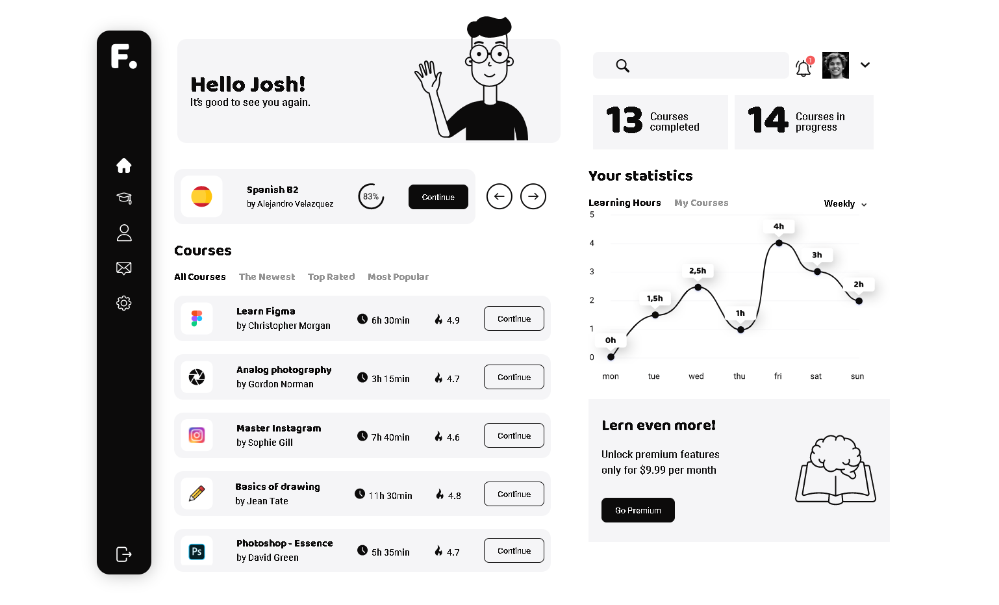
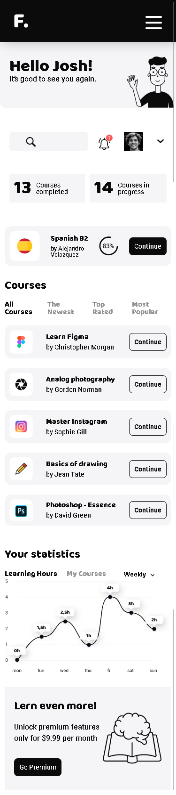

<p align='center'></p>
<h1 align='center'>Desafio Road to Dev Jr - Dashboard</h1>
<p align='center'>


</p>

<h3>🔖 Descrição</h3>
<p>Projeto desenvolvido durante o Desafio Road to Dev Jr. oferecida pelos amigos Luciano Gomes e Caio Augusto. O Desafio Road to Dev Jr é uma experiência incrivel, que nos desafia a ir alem dos nossos conhecimentos.<p>

<p>Dashboard Briefing - "Olá, eu quero jogar um jogo com você! Até agora sepassaram dias, meses de estudos, e agora chegou ahora de por em prática TUDO aquilo que você Dev, ouquase Dev, aprendeu até agora. Está na hora deseparar criança de gente grande , o projeto é grande,complexo e requer estudo, persistência e coragem.Está pronto ? Que os jogos comecem...!"
<p>

<h3>🚀 Tecnologias</h3>
<ul>
    <li>Html</li>
    <li>Css</li>
    <li>Sass</li>
    <li>Javascript Vanilla</li>
</ul>

<h3>ℹ️ Como usar</h3>

<h4>ℹ️ Pré-requisitos</h4>

<ul>
    <li><a href="https://git-scm.com/" target="_blank">Git</a></li>
</ul>

<h4>ℹ️ Rodando Projeto</h4>

```bash

# Clone o repositório
$ git clone https://github.com/Diegooliveyra/dashboard-road-to-dev.git

# Acesse a pasta do projeto no terminal
$ cd src/

# Execute o arquivo
$ index.html

```

</br>
<h3 align="center"><a href="https://dashboard-roadtodev.netlify.app/" target="_blank">🔖 Visite o site 🔖</a></h3>
</br>

<h3>🖼 Layout</h3>



<h3>📝 Licença</h3>
<p>O projeto se encontra sob licença MIT. Para mais detalhes, acesse <a href='LICENSE'>license<a>.</p>
<p>Criado com 💙 por <a href='https://github.com/Diegooliveyra/' target='blank'>Diego Oliveira</a></p>